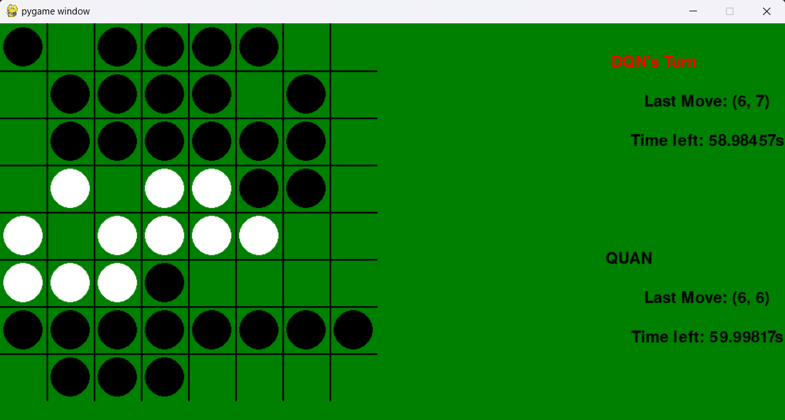

# Deep Reinforcement Learning

In this assignment, I implemented an [Othello](https://en.wikipedia.org/wiki/Reversi) agent with the application of Deep Q-Network and Prioritized Experience Replay.

<!-- For state-value function, the agent's algorithm uses a Q function for predictions and a separate Q' function for generating targets, both of which are neural networks with the same architecture. The Q-network is trained constantly, then its weights are soft-updated to the Q'-network.

For memory buffer, Sum Tree data structure is used to store the agent's experience samples with their corresponding priorities. When the memory buffer reaches its capacity, the sample with the lowest priority should be removed.

At the beginning of the training process, the agent's memory is filled up with experience samples collected from the matches between a random agent and a minimax agent. Then, the Deep Q-Network agent starts improving its action policy by replaying batches of memory samples to fit the neural network. -->

## Game.py

This file contains the main logic for the Othello game. It uses the Pygame library for graphics and user interaction. The game board is represented as a 2D array and the players make moves by selecting valid positions on the board. The game loop handles the flow of the game and updates the board state accordingly.

## DeepQNetwork.py

This file implements the Deep Q-Network (DQN) algorithm for playing Othello. It uses a neural network model to approximate the Q-values of different game states. The DQN agent learns from experience by replaying past game episodes and adjusting its Q-values based on the observed rewards. The agent chooses actions based on the highest Q-value for a given state.

## Minimax.py

This file contains the implementation of the Minimax algorithm for playing Othello. The Minimax algorithm is a classic approach for finding the best move in a game with perfect information. It explores the game tree and evaluates the utility of different moves to determine the optimal move.

## Othello.py

This file defines the Othello class, which represents the game environment. It provides methods for initializing the game, making moves, and checking for game over conditions. The Othello class is used by both the DQN and Minimax algorithms to interact with the game.

## SumTree.py

This file implements a binary sum tree data structure used in the DQN algorithm for prioritized experience replay. The sum tree allows efficient sampling of experiences based on their priorities.

## Usage

To play the game or test the algorithms, run the Game.py file. You can modify the parameters in the file to adjust the game settings, such as board size and AI difficulty.

## References

- [Reversi_visualize](https://github.com/hieugiaosu/reversi_visualize/tree/main). Thanks Hieu for allowing us to use your interface.
- [Let’s make a DQN series](https://jaromiru.com/2016/09/27/lets-make-a-dqn-theory/).
